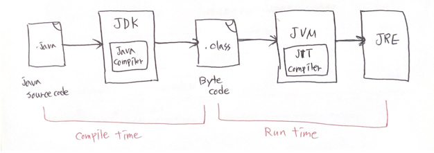

# static 메서드의 오버라이딩

왜 정적(static) 메서드는 오버라이딩이 불가능한걸까?

static = 정적이라는 의미이다. 즉, 변경될 수 없다는 것이다.   
하지만, 오버라이딩은 변하게 하는 것이다. 문법적인 오류가 발생하는 것은 당연하다.

정적 메소드와 인스턴스 메소드(non-static method)가 메모리에 올라가는 시점이 다르다.

정적 메소드는 컴파일 시점에 올라가며, 인스턴스 메소드는 런타임 시점에 올라간다.


```
컴파일 타임 : 개발자가 작성한 소스 코드를 컴파일하여 기계어 코드로 변환하는 과정 (컴파일이 진행되는 과정)
런타임 : 컴파일 과정을 마친 프로그램이 사용자에 의해 실행되는 과정
```

```
static 바인딩 : 컴파일 타임에 올라간다. 따라서 컴파일러가 어떤 메소드를 실행할지 컴파일 타임에 결정한다.
dynamic 바인딩 : 런타임 시점에 올라간다. 따라서 override 인스턴스 메소드는 런타임에 어떤 메소드가 실행될지 결정한다.
```

JVM 이 메서드를 호출할 때, instance method 의 경우 런타임 시 해당 메서드를 구현하고 있는 실제 객체를 찾아 호출한다. (다형성)   
하지만 컴파일러와 JVM 모두 static 메서드에 대해서는 실제 객체를 찾는 작업을 시행하지 않기 때문에 class method(static method)의 경우, 컴파일 시점에 선언된 타입의 메서드를 호출한다.   

그래서 static 메소드에서는 다형성이 적용되지 않는다.


### 예시1
``` java
class SuperClass {
    public static void staticMethod() {
        System.out.println("SuperClass: inside staticMethod");
    }

    public void instance() {
        System.out.println("SuperClass: inside instanceMethod");
    }
}

public class SubClass extends SuperClass {
    // overriding the static method
    public static void staticMethod() {
        System.out.println("SubClass: inside staticMethod");
    }

    public void instance() {
        System.out.println("SubClass: inside instanceMethod");
    }
}

public class TestClass {
    public static void main(String[] args) {
        SuperClass superClass = new SubClass();
        SubClass subClass = new SubClass();
    
        superClass.staticMethod();
        subClass.staticMethod();

        superClass.instance();
        subClass.instance();
    }
}

// 출력 결과
SuperClass: inside staticMethod
SubClass: inside staticMethod

SubClass: inside instanceMethod
SubClass: inside instanceMethod
``` 
static 메소드는 컴파일 시점에 선언된 타입의 메소드를 호출한다.  
그러므로 superClass와 subClass 모두 자신들의 staic 메소드를 호출한 것을 볼 수 있다.

인스턴스 메소드는 런타임 시점에 해당 메소드를 보유하고 있는 실제 객체를 찾아 호출한다.   
그러므로 superClass와 subClass 모두 자신을 호출한 객체인 SubClass를 찾아가 SubClass의 메소드를 호출한 것을 볼 수 있다.

* 참고 블로그 자료 : https://minni7.tistory.com/32